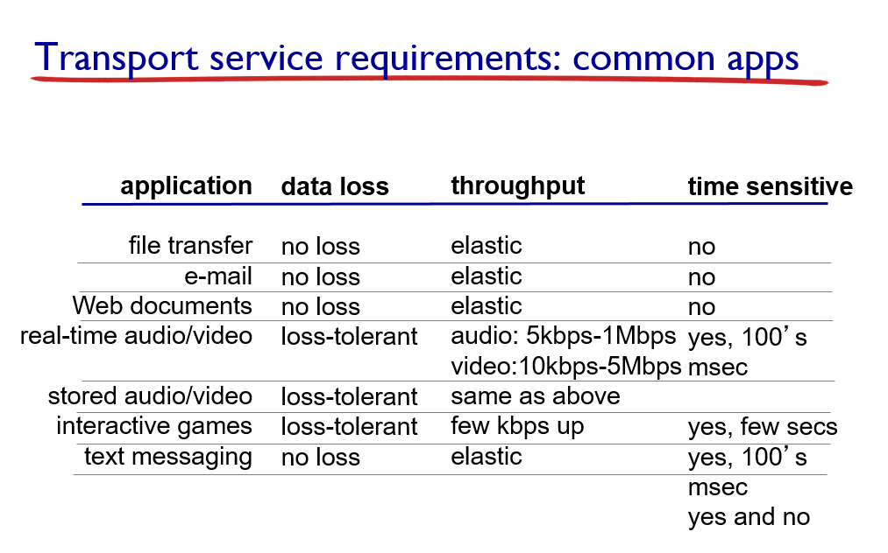
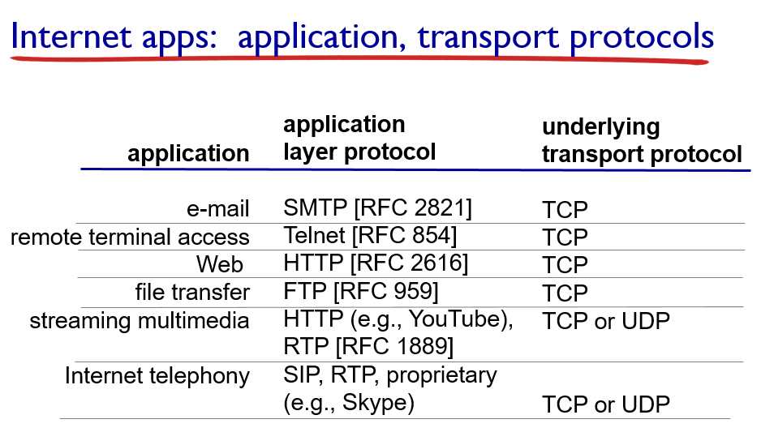
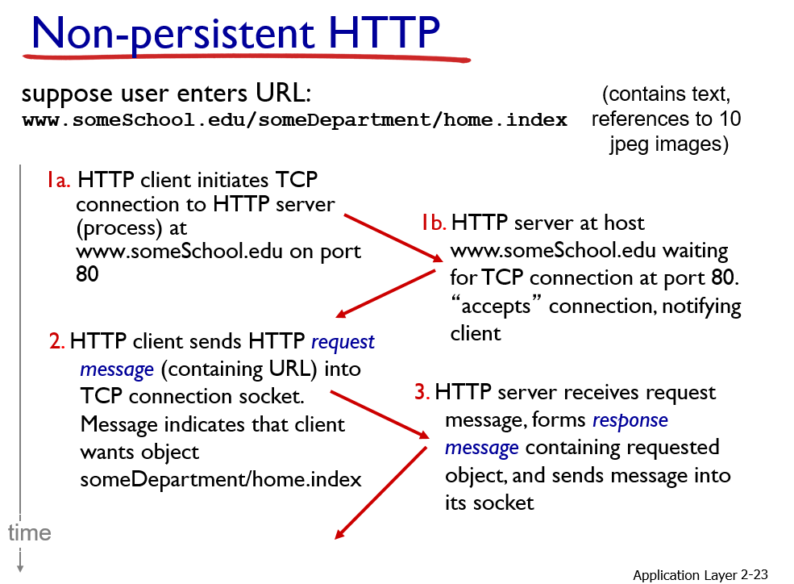
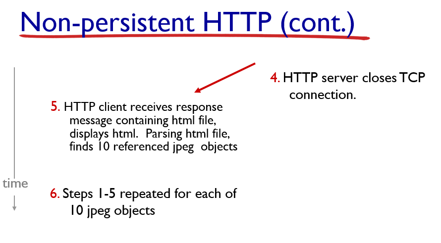

```

1장에서 인터넷의 구조와 요소들 살펴봤고 프로토콜이 무엇인가 네트워크 퍼포먼스를 어떤 메트릭으로 우리가 얘기를 하냐 그리고 시큐리티 인터넷 히스토리
여러가지 주제 얘기했어요

2장에서는 본격적으로 각 프로토콜 계층을 살펴볼건데요
제일 먼저 살펴보게 될 것이 어플리케이션 계층이 되겠어요

지난시간에 얘기한대로 우리가 앞으로 공부할 챕터들에서 많이 사용할 용어들과 기본적인 개념은 1장에서 소개했기 때문에 1장을 다 알고 들어가는 것이 강의 진행하는데 매우 도움이 됩니다

애플리케이션 계층을 얘기할때 우리가 세가지 주제를 나눠서 얘기할거에요
먼저 애플리케이션의 구조와 개념에 대해서 제너럴한 소개를 하고, 그다음에는 실제로 인터넷에서 보편적으로 사용되고 있는 이러한 프로토콜들을 직접 살펴볼거에요

그리고 마지막으로 여러분 스스로가 네트웍 애플리케이션 프로그램을 작성할 수 있는 인터페이스를 한번 공부를 해보도록 하겠어요
소켓 API라는건데 그걸 공부해볼거에요

먼저 개념과 구조, 그리고 실 예제, 그리고 소켓 API 세가지 주제를 공부하게 될거에요

여기에 매우 보편적인 네트워크 애플리케이션의 리스트가 있어요 이중에 대다수를 매우 빈번하게 사용하고 있을거에요

* Some network apps (Application Layer 슬라이드 2-3)
- e-mail, web, text messaging remote login, p2p 등...

(예시로 나온 애플리케이션에 대해 가볍게 얘기)

자 이렇게 다양한 애플리케이션들이 있는데 이들 애플리케이션은 두가지 구조중 하나를 가져요

* Application architectures
possible structure of applications : client-server, peer-to-peer (P2P)

클라이언트 서버 아키텍쳐, 피어투피어 아키텍쳐중 하나를 취하게 되요
네트웍 애플리케이션 프로그램이 이 두가지 구조중 하나를 취할뿐 아니라, 그 프로그램을 지원하는 프로토콜도 두 구조중 하나를 취하게 되어요

* Client-server architecture
- server
    - always-on host
    - permanent IP address
    - data centers for scaling

- clients
    - communicate with server
    - do not communicate directly with each other
    - may be intermittently connected
    - may have dynamic IP addresses

(클라이언트-서버 아키텍쳐에서) 커뮤니케이션을 하는 실질적인 주체는 누구에요? 호스트에요? 프로그램이에요?
컴퓨터가 커뮤니케이션을 해요? 아니에요 실제로 실행되고 있는 프로그램이 커뮤니케이션을 하는거에요

그 프로그램이 시딩하고 있는 호스트가 클라이언트-서버 아키텍쳐인 경우에는 한종류는 서버고 한종류는 클라이언트에요
그래서 서버 호스트는 어떤 호스트냐면 언제나 ON되어있는 호스트에요 물론 시스템이 일시적으로 셧다운일때도 있지만 컨셉츄얼리 서버는 항상 ON인 호스트여야해요
그리고 영구적으로 할당된 아이피 주소를 가지고 있는 호스트에요. 그리고, 클라이언트가 많을때는 그 많은 클라이언트를 응대하기 위해서 데이타 센터 형식으로 여러 동일한 기능을 하는 서버가 군집되어있는
그런 형태로 존재하기도 해요

그리고 클라이언트 호스트는, 자기들끼리 절대로 통신하는 일이 없어요 항상 서버랑 통신을 해요
서버랑 대조적으로 클라이언트 호스트들은, intermittently하게 커넥트 되어요 커넥트 됐다가 안됐다가 하고
아이피 주소도 다이나믹 IP주소 할당받는 경우가 많아요
다이나믹 IP주소는 인터넷에 연결될때마다 변경 가능한 주소에요

그래서 클라이언트 서버 아키텍쳐에서는 서버 호스트에서 실행되고 있는 프로세스와 클라이언트 호스트에서 실행되고 있는 프로세스가 서로 통신을 하게 되는거에요

* P2P architecture
- no always-on server
- arbitrary end systems directly communicate
- peers request service from other peers, provide service in return to other peers
    - self scalability - new peers bring new service capacity, as well as new service demands
- peers are intermittently connected and change IP addresses
    - complex management

반면에, 피어 투 피어 아키텍쳐에 대해서는 커뮤니케이트 하는 두 프로세스가 모두 유저 호스트에 시딩하고 있어요 그래서 이 P2P 아키텍쳐에서는
always 서버가 존재하지 않아요 그래서 그냥 서로 커뮤니케이션 하는거에요

커뮤니케이트 하는 유저 호스트를 피어라고 불러요
피어는 다른 피어로부터 서비스를 리퀘스트 하기도 하고 반대로 다른 피어에게 자기가 서비스를 제공해주기도 해요

이 피어 투 피어 아키텍쳐의 대표적인 장점이 뭐냐면 self scalability에요
클라이언트 아키텍쳐에서는 서버 호스트에게로 어때요 서버 호스트와 모든 클라이언트들이 통신을 하는거에요 클라이언트수가 많아지면 어때요 서버를 증가시켜야하죠
그런데 이 피어투피어에서는 별도로 서버가 없고 피어들끼리 서비스를 제공하기도 하고 상대로부터 서비스 받기도 하고
그렇기 때문에 어떤 피어가 시스템을 조인하면 그 피어는 리퀘스트만 갖고 들어오는게 아니라 서비스 캐퍼빌러티?까지도 가지고 들어오기 때문에 시스템의 규모가 커지더라도 서브스케일? 할 수 있는 경향이 있어요 (여기 잘 안들린다..)

하지만, 이 피어투피어 구조에서의 피어들은 일반 유저 호스트에요 그쵸? 그렇기 때문에 인터넷에 intermittently하게 커넥트되고, 다이내믹 IP를 받는다던가 하는 이유로 관리가 복잡하다는 단점을 가지고 있어요
그래서 우리가 이제 두가지 구조에서 보면, 호스트를 우리가 구분을 했어요
커뮤니케이션을 하는 주체가 누구에요? 호스트가 아니라 그 안에서 실행되는 네트웍 애플리케이션(프로그램)이에요 실행중인 프로그램을 프로세스라고 하죠
여러분이 운영체제에서 프로세스간 통신하는걸 아마 배웠을거에요

근데, 이 네트웍에서는 뭘 배우냐면 서로 다른 호스트에 시딩하고 있는 프로세스들 간에 메시지를 교환함으로서 통신하는 것을 얘기할거에요
자 그래서, 이 통신하는 프로세스는 두 종류로 나뉘어요. 그러니까 네트웍 애플리케이션 프로그램은 어때요?
서로 커뮤니케이션을 함으로서 어떤 작업을 달성하는.. 커뮤니케이션하고 있는 프로세스들로 이 네트웍 애플리케이션 프로그램들이 구성되는거에요

이 프로세스는 두 종류로 나뉜다는거에요 서버 프로세스 클라이언트 프로세스 ㅇㅇ

클라이언트 프로세스는 커뮤니케이션을 이니시에이트 하고 있는거
서버 프로세스는 클라이언트 프로세스의 컨택트를 받아서 대기하고 있다가 컨택트를 받으면 응대하는것이 서버 프로세스ㅇㅇ

클라이언트 서버 아키텍쳐 같은 경우는 클라이언트 프로세스가 어느 호스트에서 실행되고 있을가요? 

클라이언트 호스트에서 실행이 되고있죠
서버 프로세스는 서버 호스트에서 실행되고 ㅇㅇ

그렇다면 피어투피어의 경우에는 어떻게 될까요? 이 피어안에 클라이언트도 실행되고 있고 서버도 동시에 실행되고 있을수가 있어요

피어 호스트 안에는 클라이언트 프로세스와 서버 프로세스가 동시에 실행되고 있을수도 있고 둘중 하나만 실행되고 있을수도 있고 그래요

근데 우리가 지난시간에, 프로토콜 레이어링을 공부하면서 애플리케이션 계층에서는 메시지를 만들어서 그쵸?
교환할 메시지를 만들어서 그걸 누구에게 딜리버리 부탁한다고 그랬어요? 트랜스포트한테 부탁한다 그랬죠
이 애플리케이션 프로세스는 디벨로퍼가 컨트롤 하는 영역이고, 트랜스포트 계층 이하는 운영체제에 의해서 컨트롤되는 파트에요

여러분 작성하는 프로그램이, 유저 영역의 프로세스로 실행되는거구요
운영체제가 실행하는 프로세스들이 있어요, 트랜스포트 계층 이하는 운영체제가 컨트롤하는 프로세스들이 되겠어요

애플리케이션 계층에서 만들어낸 메시지는, 트랜스포트 계층으로 딜리버리를 부탁을 하게 되고
또 네트웍을 통해서 배달된 메시지는 어때요? 역시 트랜스포트 계층을 거쳐서 애플리케이션으로 배송이 이루어지게 되어요

그래서 이 계층간에는 도어같은게 필요한데 이걸 소켓이라고 해요
내보낼때도 소켓 통해서 내보내고 받아오는 메시지도 소켓 통해서 읽어오는게 되겠어요

자 그래서, 커뮤니케이션은 결국 두 호스트간에 이루어지는게 아니라 두개의 호스트에 시딩하고 있는 프로세스간에 이루어지는거에요

이 커뮤니케이션 하는.. 메시지가 딜리버리 되어야하는 목적지는 호스트에요 프로세스에요? 프로세스에요! 그쵸

그러면 과연 목적지를 어떻게 식별을 할거냐?에요

여러분 우리가 우편물같은 경우는 최종 목적지가 집이에요, 아니면 그 집에 있는 특정 인물이에요? 특정 인물이죠

그럼 봉투에 받는 사람 수신인이 어떻게 식별이 되어요? 주소 그리고 사람의 이름

그래서 호스트 아이피 주소만 가지고는 궁극적인 목적지인 메시지가 딜리버리되어야할 애플리케이션 프로세스는 식별할 수 없어요

이 호스트를 식별하는 32비트 아이피 주소와 더불어, 포트 번호라는 것을 사용해요 이 포트 번호는 호스트 안에서 실행되고 있는 어떤 프로세스를 갖다가 아이덴티파이 해주는 번호가 되겠어요

한 호스트 안에 프로세스 하나만 실행되고 있을까요? 여러 프로세스 실행디ㅗ고 있겠죠
그래서 이 포트 번호를 가지고 배달할 프로세스를 식별하게 되는거에요
그런데, http같은거는 이거는 웹 애플리케이션을 위한 프로토콜이에요 http서버의 포트번호는 언제나 80으로 고정이 되어있어요
어떤 웹서버이건간에 http서버 프로세스의 포트 번호는 얼마라구요? 80을 사용해요
이게 왜그러냐면 메일 서버의 경우에는 메일 서버 프로세스는 포트 번호 25를 사용해요 
이런걸 well-known port라고 불러요
매우 보편적으로 사용되는 서버 프로세스의 경우는 고정된 포트 번호로 사용을 해요
왜냐면 서버 프로세스들은 여러 클라이언트들이 컨택을 해요 그럼 컨택할때 어때요?
파이널 데스티네이션의 포트 번호 명시해야되는데 그걸 다 알고 있게 하기 위해서에요
어느 클라이언트 프로세스나 내가 이 http서버 프로세스에게 뭔가 리퀘스트 해야한다 하면 ㅇㅇ
그 서버의 아이피 주소는 다 달라지겠지만, 포트 번호는 항상 이걸로 고정이 되는거에요

그래서 ip주소는 이렇게 생겼죠 (128.119.245.12)
실제 ip주소는 32비트에요
이 숫자를 세자리 숫자가 8비트 2진수에 해당하는 숫자에요
맥시멈은 255가 되겠죠
그래서 32비트를 쫙 0과 1의 시퀀스로 나열하면 사람이 보기 힘들기 때문에 이런 노테이션을 사용하는거에요 8비트씩 짤라서.

그래서 호스트는 아이피 주소로 식별을 하고, 포트번호로 그 호스트내에서 프로세스를 식별하게 되는거에요

자 그래서 이제 어플리케이션에서는 데이타 딜리버리를 트랜스포트 계층에 부탁하게 되는데, 그럼 과연 어떤 트랜스포트 서비스를 원할까? 를 우리가 한번 생각해보도록 하겠어요

어떤 애플리케이션에 대해서는 data integrity가 중요해요
예를 들어.. 파일 트랜스퍼나 웹 트랜젝션 같은 경우 ㅇㅇ

웹에 뭔가를 막 리퀘스트 웹에 폼을 갖다가 필아웃 한다거나 파일을 트랜스퍼 받을때 군데군데 오류가 발생할 수 있다,
그러면 거의 서비스의 가치를 0으로 만들어버리죠 그쵸?

그렇기 때문에 파일 트랜스퍼나 웹 트랜젝션 같은 경우는 데이타 인테그러티가 매우 크리티컬한 트랜스포트 서비스 요건이에요

그러나, 반면에 오디오나 비디오 같은거 생각해보면 사람 눈이나 귀는 어느정도의 오류가 있더라도 그걸 노티스 못하거나 노티스 하더라도 인포메이션을 인지할 수 있는 능력이 있기 때문에
이러한 오디오 비디오 데이타를 전송하는 애플리케이션의 경우에는, loss에 상당히 tolerate해요 (위에 쓴 애들보다는 치명적이지 않음)

그런데, 인터넷 텔레폰이나 인터랙티브 게임 같은 경우는 로우 딜레이가 굉장히 중요해요 크리티컬 해요
왜냐면 그쪽에서 말을 하면 아주 짧은 시간 안에 상대방에게 배달이 되어서 들을수 있어야되죠

이때 딜레이라는것은 소스쪽에서 데이타 발생한 이후로 얼마 뒤에 리시브쪽에서 받을 수 있는지에 대한거에요

또, 어떤 앱의 경우에는 미니멈 뜨루풋이 개런티 되는 것이 매우 중요한 앱들도 있어요 가령 멀티미디어 스트리밍 같은 경우
오디오나 비디오 스트리밍 같은 경우에는 단위 시간동안 단위 시간안에 일정량의 프레임이 있어야만 비디오든 오디오든 재생할 수 있어요
그러니 어때요? 그 단위시간동안 필요한 프레임을 네트웍이 반드시 배달할 수 있어야겠죠
그래서 스트리밍 같은 경우 미니멈 뜨루풋이 굉장히 중요해요
어떤 앱은 이런걸 필요로 하지 않아요 ㅇㅇ 그런 앱들을 elastic apps라고 해요
가령 예를 들어서 ftp같은거, 뜨루풋이 높으면 즉 단위시간당 데이타 전송량이 많으면 빨리 파일이 받아서 좋을거에요 그렇지만 좀 늦어져서 사용자가 수초정도 늦게 받는다고 해도
크게 불편함을 느끼진 않아요 그래서 이런건 그렇게 크리티컬하진 않다

그다음에, 어떤 앱의 경우에는 인크립션이나 데이타 인테그러티같은 보안 문제가 굉장히 중요한 트랜스포트 서비스 리콰이먼트가 되겠어요

그래서 이와같이 앱별로 중요한 트랜스포트 서비스 요건이 달라요. 그래서, 매우 보편적인 앱에 대해서 정리해보자면

```



```

그러면 실제로 인터넷에서 트랜스포트 서비스를 제공하는 프로토콜은 어떤것이 있냐
tcp랑 udp가 있는데
tcp는 릴라이어블 트랜스포트를 제공하는데, tcp라는 프로토콜에게 데이타 딜리버리를 부탁하면 앱은 뭘 확신할 수 있어요?
상대방에게 절대로 오류없이 순서대로 잘 도착했을거다라고 확신 할 수 있다
반면에 udp는 언릴라이어블 트랜스포트를 제공해요 얘는 최선을 다해서 배송을 해줘요
그럼 도대체 udp가 왜 필요해요? tcp를 쓰지.. 왜 그러냐면 네트웍 계층에서는 어디까지 배달해줍니까 목적지 호스트 ㅇㅇ
udp를 선호하는 앱이 있어요 왜냐면 tcp는 이런 릴라이어블 트랜스포트와 그 외의 서비스를 제공하기 위해서 커넥션 오리엔티드로 동작해요 그래서 tcp 트랜스포트를 부탁을하면
먼저 이 tcp는 상대방 tcp와 핸드셰이킹을 해서 커넥션을 셋업해요 물론 물리적인 커넥션이 아니고 개념적인 커넥션이죠
그래서 서로 '너니?' 확인하는 핸드셰이킹 과정을 거쳐요
그리고 데이타 주고 받으면서 니가 준거 빠졌다 어쨌다해서 다시보내라 하고 그래서 릴라이어블리티, 데이타 인테그러티를 보장하는거에요

이 tcp는, 커넥션을 셋업하기 때문에 이걸 이용해가지고 릴라이어블 트랜스포트 이외에도 플로우 컨트롤이나 컨제스쳔 컨트롤도 하게되요
플로우 컨트롤이라는게 뭐냐면 두 tcp가 있을때 이 tcp들은 둘다 버퍼를 가지고 있어요
이게 센딩 tcp고 이게 리시빙 tcp라고 할때, 센딩 tcp는 애플리케이션으로부터 배달할 데이타를 받으면 그걸 일단 버퍼에다가 받아요
그래서 여기로 내보내거든요
이 시딩 tcp는 네트웍 계층을 통해서 이쪽에서 전달한 패킷이 들어오면 그걸 일단 자기 버퍼에다가 받고 그리고, 이 버퍼로부터 애플리케이션으로 올려보내요

이 버퍼가 유한하기 때문에, 센딩 tcp쪽에서 막 빨리 보내면 리시빙 tcp 버퍼가 어떨 수 있어요? 막 찰수가 있어요
애플리케이션이 뽑아가는거보다 더 빠른 속도로 네트웍으로부터 데이타가 밀려들어오면, 이 버퍼가 점점점 차나갈수 있어요
그럼 이 커넥션을 통해서 얘가 센딩한테 너무 빨리보낸다고 슬로우다운해. 그래가지고 리시빙 오버플로우를 막을수도 있어요
그걸 플로우 컨트롤이라고 해요

뿐만 아니라, 자 이 센딩 tcp와 리시빙 tcp 사이에 뭐가 있죠? 네트웍이 있어요 그쵸?
네트웍의 요런 라우터들을 홉 바이 홉으로 거쳐서 도착하게 되죠
근데, 이 네트웍의 이 둘사이에 흐르는 경로상에 라우터에 버퍼가 막 차나갈수가 있어요 거기 혼잡이 발생해가지고
그때도 어때요? 이 커넥션을 통해서 그걸 노리스해가지고 센딩 tcp가 자기 나가는 레이트를 줄여요
그걸 컨제스쳔 컨트롤이라고 해요

플로우 컨트롤은 리시버의 버퍼를 overwhelm 하지 않는 컨트롤인 반면에, 컨제스쳔은 네트웍의 컨제스쳔 피하기 위한 컨트롤이에요
차이점을 알겠죠?

그럼 '어.. tcp가 왜 데이터 인터그레티를 보장하는 릴라이어블 트랜스포트일뿐만 아니라 플로우 컨트롤 컨제스천 컨트롤 지원하는 아주 파인한 트랜스포트 컨트롤인데 왜 udp쓸일이 있을까?'

tcp는, 커넥션 셋업한다고 했죠. 유저가 어떤 메시지 딜리버리 부탁하면 일단 핸드셰이킹하고 커넥션 관리하기 위한 오버헤드가 발생해요

가령 들어서 애플리케이션이 메시지 하나 보내고 받으면 끝나는? 그런 앱이라고 합시다

그럼 어때요? 메시지 하나 보내고 값 하나 받기 위해서 커넥션 셋업하고 다시 클린업하고 이런 과정을 거쳐야 하죠 배보다 배꼽이 더 커지는 상황이 발생해요

원타임 트랜잭션 스타일 애플리케이션의 경우는 udp가 더 좋을수 있어요

그리고, 아이러닉하기 데이터 인테그러티가 극히 중요한 앱이라고 생각해보세요
트랜스포트 서비스만 믿기보다느 ㄴ어떠케 하겠어요? 앱 내에서 데이타 인테그러티를 확인할 수 있는 어떤 ㄱ자업을 하겠죠 그렇죠
그런 경우에는 앱 계층에서의 데이타 인터그레티 체킹과 트랜스포트 계층에서의 릴라이어블 트랜스포트가 반복적인 경향이 있어요

앱 자체가 데이타 인테그러티를 확인하는 앱이라면 굳이 tcp를 사용하기보다는 더 심플한 udp를 선호할수도 있어요

지금 제가 두가지 케이스 얘기했죠 또다른게 뭐냐면.. 이 플로우 컨트롤이나 컨제스쳔 컨트롤이 문제가 될수가 있어요
멀티미디어 스트리밍은 뭐라고 했어요? 미니멈 뜨루풋 개런티 필요하다고 했죠 단위시간당 최소 몇 프레임은 받아야된다는 ㅇㅇ

근데 tcp는 어떠겠어요 만약에 네트웍의 컨제스쳔이 심하다, 그럼 센딩에서 데이타 막 내려보내도 어떻게 하겠어요
네트워크 안내보내고 홀드하고 있어요 그렇기 때문에 리시빙 앱에서 단위시간당 일정량의 프레임을 배송받는거를 갖다가 트랜스포트에서 본의아니게 막을수 있어요
그런 경우에도 tcp는 좋지 않은 프로토콜인거죠 ㅇㅇ

그래서 앱에 따라서는 udp를 사용하는 애플리케이션이 있다는거에요

이렇게 tcp가 더 파인한 컨트롤을 제공하는 프로토콜임에도 불구하고 udp가 선호될 수 있는 케이스를 우리가 봤어요

하지만 tcp나 udp 모두, 타이밍이나 미니멈 트루픗 개런티, 시큐리티 이런거는 둘다 제공해주지 않아요

즉, 이러한 서비스 리콰이먼트들은 다루어주는 트랜스포트 프로토콜이 현재 인터넷에는 없는거에요

이제까지 연구가 안되었냐? 그렇지 않아요 ㅇㅇ
많이 연구되었지만 새로운 트랜스포트 프로토콜 제안되기도 했어요 그렇지만 디플로이된게 많지 않아요

자 그래서, 이게 현황이에요 인터넷에서는 기존의 데이타 애플리케이션 이외에 텍스트 위주의 데이타를 교환하는 앱 이외에 멀티미디어 스트리밍 요구하는 새로ㅇㄴ 앱들이 마니 등장해서ㅌ
이런 미니멈 트루풋 개런티나 타이밍 이슈 중요해졌지만 그걸 실제로 아주 직접적으로 지원해주는 트랜스포트 프로토콜 자체는 업다는거에요
지금의 프로토콜은 데이터 인테그러티 보장해주냐? 못하냐 이렇게 두가지 종류 ㅇㅇ

왜냐면.. 1990년대 중반정도까지만 해도 어때요? 오디오나 비디오를 인터넷을 통해서 스트리밍 하는 그런 앱은 거의 없었어요
그러키 때문에 원래 당초에 이것들은 매우 초기에 만들어진 프로토콜들이에요
그당시에 그런 앱 없었기 때문에 이런 리콰이먼트 없었고.. 그냥 인테그러티 보장해주냐 못하냐만 보고 디자인을 했죠ㅇㅇ

이제 보편적으로 쓰는 앱들이 뭘 사용하고 있는지 봅시다

```



```

우리가 지금 얘기한거에서 어떤걸 봤냐면 현재 보편적으로 쓰는 앱에서 요구하는 사항들을 현재의 트랜스포트 프로토콜만으로는 만족시키지 못하는 부분이 있다는걸 본거에요

미스매치가 있는거죠 ㅇㅇ

그다음에, 이제 앱 프로토콜이 어떤걸 정의하는지, 어떤것이 정의되어야하는지 살펴봅시다

먼저 교환하는 메시지 종류가 뭔지를 정의해요
request 메시지, response 메시지

그다음에 각 메시지의 신택스를 정의해요
메시지의 어떤 필드들이 있고, 어떤 델리니에이션 어떻게 구분지어지고 등등 ㅇㅇ

그리고 이 메시지의 세맨틱 어떻게 해석해야하나

그리고 어떤 메시지를 받았을때 어떤식으로 리스폰드 해야하고 언제 어떤 메시지를 보내야되고 이런것들 룰들을 정의하고 있어요

이제 애플리케이션 레이어 프로토콜은 두종류가 있어요
open이냐, proprietary냐
이건(proprietary) 오픈되어있지 않기 때문에 실제로 어떻게 동작하는지 몰라요 스카이프가 그래요
어떤식으로 동작하는지를 짐작은 할뿐 실제로는 정확히 알지 못해요

하지만 오픈 앱 프로토콜들 즉 http나 smtp같은 애들은 이건 다 오픈이에요
오픈인것들은 인터넷 표준을 담고 있는 rfc 도큐먼트에 다 오픈되어있어요
그래서 어떤 프로토콜이 오픈이면, 굉장히 유용한 점은 뭐냐면 interoperability가 좋다는거에요

왜냐면 이 규약에 따라서 메시지 주고 받으면 되니까ㅇㅇ 규약이 오픈되어있기 때문에 어떤 앱이라도 해도 그 규약에 따라서만 메시지 만들고 리액트하고 그러면 서로 통신할 수 있는거죠

그래서 이제 우리가 이정도 해서, 애플리케이션 프로그램과 애플리케이션 프로토콜이 취할 수 있는 구조와 그리고 애플리케이션의 리콰이먼트 등등 기본적인 개념 살펴보았고
이제 우리가 다섯가지 정도의 보편적인 프로토콜 살펴볼거에요 모두 인터넷에서 가장 보편적으로 사용되고 있는 프로토콜이에요
(web and http, ftp, smtp/pop3/imap, dns, p2p)

자 제일 처음볼게 http라는 프로토콜인데, 이 프로토콜은 여러 앱에서 사용되고 있지만 대표적인 앱은 Web이에요 Web을 위해서 만들어진 프로토콜이에요
자 우리가 이제 웹페이지 생각해봅시다 웹페이지는 실제로 여러개의 object로 구성되어있어요 기본적으로는 한 페이지의 프레임을 base html-file이 디스크라이브하고 있구요
그 안에 각 object에 대한 레퍼런스를 포함하고 있어요 이 레퍼런스는 url 형식이에요
이런식으로 host name, path name. 여러분이 이런 url은 많이 봤죠 ㅇㅇ

이 각 url은, 각 object들은 jpeg일수도 있고 오디오 파일일수도 있고 자바 애플릿일수도 있고 그래요

여러분이 웹페이지를, url을 타이핑 하면 어때요? 처음에 텍스트들이 막 뜨는데 군데군데 비어있죠
그리고 동시에 좍 뜨는 경우도 있지만 군데군데 비어있을수도 있는데 이게 이미지나 오디오등이 나중에 채워지기도 하죠
이게 별도의 오브젝트인거에요 얘네를 다 base html 파일이 디스크라이브 하고..


http라는 프로토콜은 어떻게 동작하냐, http는 일단 hypertext transfer protocol의 약자에요

http라는 프로토콜은 웹 앱 이외에도, 이메일에서도 사용하는 경우도 있어요
아까 봤을지도 모르지만 멀티미디어 스트리밍 할때도 사용하는 경우도 있어요
그러므로 다른데서도 사용되는 프로토콜이지만, 일단 웹을 위해서 디자인되었어요

이 http 프로토콜은 아까 우리가 수업 시작에서 봤던 구조중, Client-Server 구조를 따르고 있어요

그러면 클라이언트 프로세스는 과연 뭐냐, 여러분의 브라우저에요
그럼 이게 어때요? 여러분이 브라우저에 url타이핑 하면 그 url에 해당하는 웹서버에 가서 웹페이지를 리퀘스트하고 그걸 받아서 여러분의 스크린에다가 디스플레이해주는 역할을 해요

서버 프로세스는, 어떤 역할 하냐면 웹 서버 호스트에 드러앉아가지고 브라우저들의 컨택을 기다려요 어떤 브라우저가 url을 보내면서 여기에 해당하는 웹페이지 달라는 리퀘스트를 주면
해당 object를 갖다가 전송해주는것이 서버가 되겠어요
그래서, 여기보면 firefox라는 브라우저를 실행하는 pc가 있구요. 사파리 브라우저 실행하는 아이폰이 있어요. 이 각각 서로 다른 프로그램이에요.
그런데, 이 서로 다른 프로그램이지만 얘네는 http가 정의하는 방식을 고대로 따라서 리퀘스트 메시지를 만들고 리스폰스를 받는 일을 해요
여기서 보면, 아파치서버에다가 http가 정의하는 리퀘스트 메시지를 보내요
그럼 아파치서버는 얘를 해석할수 있겠어요 없겠어요? 있어요 왜냐면 http가 정의하는 메시지 신택스 메시지 세멘틱스 그리고 이 리퀘스트 받았을때 리스폰스 어떻게 생성해야된다는걸 http라는
프로토콜이 정의해주고 있기 때문에 이게 파이어폭스가 보냈던 사파리가 보냈던 다 얘는 어때요? 대답할 수 있어요 http 리스폰스 보내주게 되고 ㅇㅇ

자 그래서, 이 http라는 애플리케이션 프로토콜은 트랜스포트 서비스를 누구에게 요청하냐면 tcp에게 요청해요
왜 그래요? http가 서포트하는 애플리케이션 메인 앱이 누구에요? Web
Web은 뭐가 중요해요? 데이타 인테그러티 그러므로 udp에게 부탁하지 않고 tcp에게 트랜스포트 부탁하는거에요
그래서, http는 브라우저가 사용자가 브라우저에다가 url치고 엔터 누르면 http 리퀘스트 메시지 만드는데
거기다가 리퀘스트 메시지 전달하기전에, tcp를 이용하니까 tcp 커넥션을 맺어야해요 그래서 클라이언트가 tcp 커넥션을 이니시에이트해요 서버에게 ㅇㅇ
http서버는 항상 포트 몇번에 대기하고 있다구요? 80번
그래서, 서버의 아이피 주소를 발견해가지고 서버의 아이피주소와 서버의 포트번호 이용해서 거기다가 tcp 커넥션 몇자라고 커넥트를 하는거에요
서버가 뭐에요? 커넥션을 억셉트! 하게 되고 핸드셰이킹 끝나고 커넥션 맺어진거에요
그 커넥션을 통해서 어때요? http메시지 주고 받게 되요
그래서 http 리퀘스트 보내고 리스폰스 받고, tcp 커넥션이 클로즈되게되요
이런 일련의 과정을 거치는데 http라는 프로토콜은 stateless한 프로토콜이에요 이게 뭐냐면
유저가 이전에 보낸 리퀘스트가 어떤건지를 전혀 기억 안해요 서버가 클라이언트가 보낸 리퀘스트 히스토리를 전혀 기억 안하고 있다는거에요
그래서, 이 프로토콜이 stateful하려면 매우 오버헤드가 커지고 복잡해져요

가령 서버가 클라이언트가 보낸 리퀘스트 히스토리를 기억하려면 어디다가 저장해야해요
그런데 이 저장하는거자체가 오버헤드일뿐만 아니라, 만약에 크래시 발생하면 서버와 클라이언트 뷰를 일치시키는데도 상당한 오버헤드랑 코스트가 필요해요

그렇기 때문에 많은 프로토콜들이 stateless하게 동작해요 과거에 뭐했는지 기억하지 않아요
http도 stateless라는거에요

최초의 http는, 얘도 버전이 계속 업그레이드 되었어요
처음에는 non-persistent했어요 이게 뭐냐면 서버측에서 object하나 보내주고 나면 바로 tcp 커넥션을 자동으로 쾅! 클로징 해버려요
여기서 뭘 예상할수 있어요? 웹페이지가 단 하나의 오브젝트가 아니라 여러 오브젝트로 구성된다고 했죠
웹페이지 하나 받기 위해서, 가령 오브젝트 열개면 tcp 커넥션 열번 맺어야 하는거에요 매우 비효율적이죠
다음시간에 얼마나 비효율적인지 살펴볼건데, 그래서 이후에 http버전에서는 persistent HTTP가 디자인되었어요
그래서 이 persistent HTTP에서는 tcp 커넥션 맺은 다음 여러 오브젝트 딜리버리 할 수 있게 했어요

```



