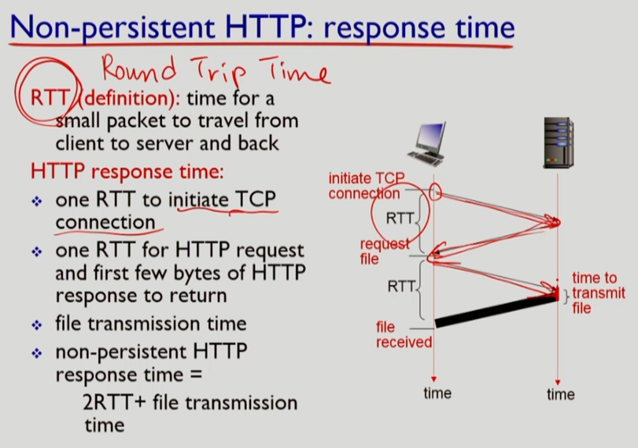
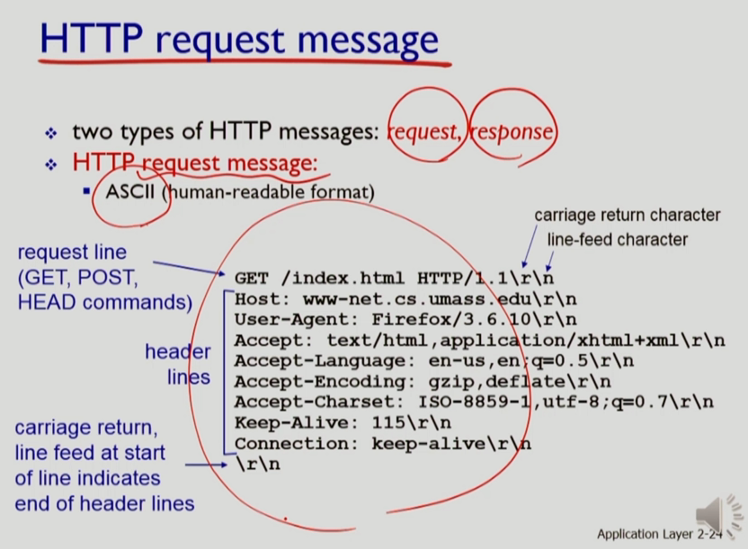
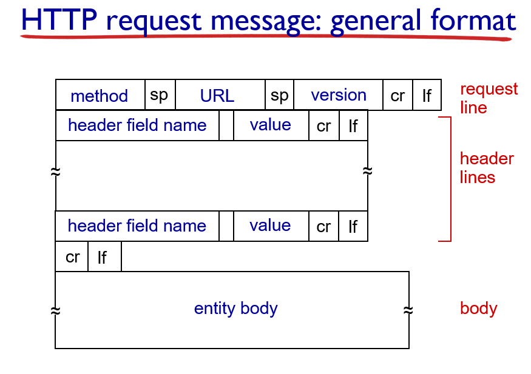

```

먼저 Non-persistent HTTP의 동작에 대해 자세히 보도록 하겠어요

http는 tcp위에서 동작함으로, 유저가 브라우저에다가 이와 같은 url을 타이핑하면 먼저 브라우저는 뭘 하냐면
브라우저가 http 클라이언트죠 이 클라이언트는 tcp 커넥션을 이니시에이트 해요
즉, http 서버 쪽으로 tcp 커넥션을 맺자는 요청을 보내요
서버는 이거죠 url에서 보면 서버의 주소가 이거죠
서버의 요 port 번호로. 포트번호가 어떻다고 했죠? http는 아주 보편적이라 언제나 포트번호 80을 사용. well-known port라고 했죠
그리고 얘는 http 클라이언트로부터 컨택트가 들어오길 기다리고 있어요.
커넥션을 맺자는 요청이 들어오면, 서버가 이 요청을 accept하게 되고 tcp 커넥션이 맺어지게 되는거에요.

그다음에는 클라이언트가 http 리퀘스트 메시지를 갖다가 서버쪽으로 보내주게 되요. 이걸 받은 http 서버는, 이에 대한 리스폰시브 메시지를 클라이언트로 보내요.

request message는 원하는 오브젝트에 대한 url이 표시. response message는 그 리퀘스트한 오브젝트를 실어주게 되어요.

서버는 넌 펄시스턴트 http로 동작하므로, 이 리퀘스트된 오브젝트를 보낸다 하면 어떻게 될까요? 서버는 자동적으로 tcp 커넥션을 클로즈 해버려요.
그러면 http 클라이언트는 이제 리스폰스 메시지를 받아서 이 메시지에 실려있는 베이스 html 파일을 가지고 스크린에다가 그.. 웹페이지를 갖다가 디스플레이 해주고.
그리고 또, 그 html 파일을 파싱을 해요. 거기서 추가적으로 그 베이스 html 파일이 참조하고 있는 10개의 오브젝트들을 발견하게 됐어요.
그럼 이 오브젝트들을 가져와야 웹페이지가 컴플리트되는거에요 그쵸? 그럼 이걸 추가적으로 받아오기 위해서 어떻게 해야될까요?
아까 말한 1번부터 5번까지 다시 해와야되는거에요. 다시 컨택트하고 오브젝트 받아오고... 반복.
이것들 각각을 위해서 1번부터 5번까지 스텝을 반복해줘야 한다 이거에요.

커넥션이 맺어졌다는것은, 서버 프로세스와 클라이언트 프로세스의 사이에 얘가 tcp로 내려보내는 데이타를 받을 소켓과 이쪽에 네트웍에서 올라오는 데이타를 애플리케이션으로 tcp가 올려줄 소켓을 만든다는 얘기에요.
즉 소켓이 create되는거에요. 클라이언트에서도 소켓이 create되고, 서버에서도 되고.
소켓의 역할이 뭐하는거였어요? 애플리케이션과 트랜스포트 계층 사이에 대문같은거였어요. 여기를 통해서 앱이 데이타 내려보내고, 여길 통해서 앱이 데이타를 트랜스포트에서 받는거였어요.
소켓이 센딩쪽과 리스닝쪽 (서버랑 클라이언트)을 각각 담당하는거에요

그다음에 tcp 커넥션을 통해서 리퀘스트랑 리스폰스 메시지 주고받는다는 얘기는 어때요? 이 소켓을 통해서 메시지 내려보내고, 이 소켓을 통해서 메시지 받고
또 소켓 통해서 서버는 리스폰스 내려보내고 소켓 통해서 클라이언트가 리스폰스 올려받고 한다는 얘기에요.

자 그러면, 이와같은 넌 펄시스턴트 http의 경우에 리스폰스 타임이 어떻게되나를 살펴보도록 합시다.
리스폰스 타임이라는 것은, 유저가 브라우저에다가 즉 클라이언트 프로세스에다가 url을 타이핑을 하고 탁! 리턴을 한 이후로
유저에게 그 웹페이지가 팝업할때까지 얼마나 시간이 걸리냐. 그게 리스폰스 타임이라고 했어요.

이 리스폰스 타임 살펴보기전에 요약어를 하나 보겠어요.
RTT. Round Trip Time의 약자에요. 그래서, 아주 작은 패킷. 우리가 아주 작다라고 얘기할때 기준이 뭐냐면... 이 패킷을 트랜스미트 하는데 (미디어에 밀어넣는데) 걸리는 시간이 패킷이 너무 작으면 어때요?
거의 무시할만하겠죠. 그렇게 작은 패킷이라는거고 그 패킷이 클라이언트로부터 서버로 갔다가 서버에서 클라이언트로 돌아오기까지 걸리는 시간. 그래서 라운드 트립 타임이에요.
그 시간을 RTP라고 할 때, 논 펄시스턴트 http의 리스폰스 타임을 보도록 하겠어요.
먼저, tcp 커넥션을 만들기 위해서 어때요? one RTT가 필요해요. 왜냐면 커넥션 맺자는 요청을 서버에게 보내고 서버가 ok.. accept하는 그 시간에 one RTT가 소요되어요.

맺어지면 어때요? 그러면 클라이언트가 먼저 리퀘스트 메시지 보내죠. 그럼 서버가 리스폰스 메시지 보내는데 리스폰스에 뭐 들어있어요? 그 요청된 오브젝트가 실리게 되겠죠.
그 오브젝트는 상당한 크기가 되므로 이 바의 두께는 오브젝트를 밀어넣는 시간이라고 생각하면 되겠어요.

```

```

즉 그래서 결국.. 리스폰스 타임은 2RTT + file tranmission time 이렇게 되겠어요.
자 그러면, 리스폰스 타임은 이런데 웹페이지 전체가 다 오기까지는 시간이 얼마나 걸리는지 봅시다.
이 리스폰스로 웹페이지가 다 온걸까요? 아니죠 베이스 html만 온거에요
베이스 html이 추가적으로 다섯개 오브젝트 가지고 있다면 어떨까요?
다섯개가 다 와야 웹페이지 완성되는거죠 ㅇㅇ 전체 웹페이지 하나 다 받기까지의 시간을 생각해보도록 합시다.

넌 펄시스턴트 http의 경우에는, 오브젝트 하나 보내고 나면 서버가 클로즈하므로 매 오브젝트마다 tcp 커넥션 다시 열어야해요
오브젝트 리퀘스트도 하고, 리스폰스도 받고..
각 오브젝트별로 두번의 RTT가 필요하다는거에요.
그러므로, 처음에 베이스 html 파일 받아오는데 2RTT. tcp 커넥션 맺고 베이스 html 리스폰스. 
각 오브젝트도 반복..
그럼 오브젝트만 해도 5*2RTT..
상당히 긴 시간이 흘러요. RTT가 매우.. 상당히 크다면 어떨까요? 시간이 상당히 흘러야 웹페이지가 완성된다는거에요.

그러므로 이 딜레이를 피하기 위해 경우에 따라서는, 패러럴 tcp 커넥션을 브라우저가 맺기도 해요 ㅇㅇ
브라우저가 처음에 베이스 html 파일 받아보고나서 파싱을 했더니 다섯개의 추가적인 오브젝트에 대한 레퍼런스가 추출이 됐어요

그럼 어떻게 하냐면 브라우저가 tcp 커넥션 다섯개를 동시에 오픈하는거에요.
그래서, 결국 소켓이 동시에 몇개가 오픈되는거죠? 다섯개가 열리는거에요.
tcp 커넥션 다섯개 맺는다는거니까 다섯쌍의 소켓이 생기는거에요

그래서 베이스 html 파일 받아오고, 그다음에 tcp 커넥션 맺자는 요청을 다섯개 연달아보내는거에요.
그럼 그거에 대한 ok가 다섯개 연달아 오겠죠.
요 tcp커넥션 리퀘스트 하는 인터벌이 매우 작다고 가정하면 이게 한 RTT가 될거에요 그쵸.

그런다음에 어때요? 이제 커넥션이 다섯개가 동시에 열려있으니까 각 커넥션으로 어때요? 각 커넥션을 통해서 리퀘스트 메시지를 동시에 내보낼 수 있겠죠.
리퀘스트 메시지가 동시에 다섯개 나가고, 리스폰스 메시지 다섯개가 거의 동시에 들어올거에요.
이렇게 하는것이 패러럴 tcp 커넥션 쓴다는거에요.
그런데 브라우저가 이런 커넥션을 맺게 되면 OS는 어때요? 이 프로세스에 대해서 여러 TCP 커넥션을 서포트 해줘야하는 오버헤드가 있어요.
트랜스포트 계층부터는 누가 관리하죠? 운영체제가 관리하는거에요
운영체제가 소켓 할당해주는건데 이 tcp 커넥션 맺어주는것도 운영체제 리소스 사용하는거에요~
왜냐면, 소켓을 할당해줘야하고 우리가 거기에 대한 모든 운영체제의 오버헤드를 논의할 수 없겠지만...
소켓 자체도 운영체제 리소스고. 각 tcp 커넥션마다 버퍼가 필요해요 ㅇㅇ
우리가 지난시간에 tcp 얘기할때 이런 얘기했어요. tcp가 커넥션 오리엔티드 서비스 제공하는 트랜스포트 프로토콜인데 어떤다고 했어요?
유저가 내려보내는 메시지를 일단 버퍼에 받아. 그리고 뭐에 따라서 컨제스천 컨트롤과 윈도우 컨트롤 두 컨트롤에 의해서 결정되는 레이트로 여기서 뽑아낸다고 했어요.
그러므로 tcp 커넥션마다 버퍼가 필요하다는거에요.
받는 측에서도 네트웍으로부터 올라오는 메시지를 버퍼에다가 받아요. 그러고나서 어플리케이션에서 읽어가는 속도로 읽어가는거에요..
그래서 tcp 커넥션마다 소켓도 할당해야되고 버퍼도 할당되어야하고 이와같은 운영체제 자원이 할당되어야함으로
그리고 tcp 커넥션을 또 관리도 해줘야하고 이런 여러가지 운영체제 오버헤드가 추가적으로 부가가 되게 된다.

그래서, 이 펄시스턴트 http는.. 이제 가장 최초의 버전인 http 1.0에서는 넌 펄시스턴트로 동작한거에 반해서
그 이후에 나온 http 버전들은 펄시스턴트 모드로 동작하는걸로 허용되어요.
오브젝트를 하나 내보낸다음에, 커넥션을 갖다가 그냥 오픈한채로 놔두는거에요.
그래서 추가적으로 들어오는 리퀘스트 메시지 받고, 동일한 클라이언트로부터 추가적으로 오는 리퀘스트 메시지를 받고 또 리스폰스 메시지를 보내주고 할 수 있도록.

그래서 이렇게 한다면, 서버가 tcp 커넥션을 닫지 않고 내버려둔다면 어떻게 동작할 수 있을까요?
처음에는 one RTT 필요하고 받아오는데 또 one RTT 필요하겠지만
베이스 html 받아오면, 이 시점에는 어떻게 할 수 있어요? 베이스 html 파싱해서 추가적으로 필요한 오브젝트 다 파악할 수 있겠죠 클라이언트가.
그럼 이 클라이언트는 이미 열려있는 소켓을 통해서 object 1에 대한 리퀘스트 메시지, 2에 대한 메시지, 이렇게 다섯개를 줄줄이 내보낼 수 있어요.

이 리퀘스트 메시지 내보내는 시간이 무시할만큼 짧다고 한다면, 이 시간 자체가 거의 1RTT가 될거에요.

그래서 거의 1RTT만에 남은 데이터를 받아올 수 있어요.

집에가면, 연습문제 풀어오세요~
풀어보면 동작방식 확실히 이해할 수 있으니깐 ㅇㅇ

http의 메시지를 살펴봅시다

http는 두종류의 메시지를 사용해요 리퀘스트랑 리스폰스 ㅇㅇ

먼저 리퀘스트 메시지 살펴보도록 할게요
http의 메시지는 아스키코드로 표현이 되어있어요. 즉, 이게 정말 http 리퀘스트 메시지가 생긴 모양이에요.

```

```
http 리퀘스트 메시지의 구성을 보면, 젤 처음은 리퀘스트 라인이에요.
그다음에 한줄 이상의 헤더라인이 오게되어요. 헤더라인의 끝은 carriage return과 line feed 문자로 식별이 되고.
그다음에 경우에 따라 entity body가 오는경우도 있고 오지 않는 경우도 있어요.

리퀘스트 라인을 한번 살펴보면, 처음에 오는 GET이 뭐냐면 메서드에요.
서버에게 어떤 작업을 해달라고 표시하는 것이 바로 이 메서드에요.
GET이 뭐냐면 이 다음에 오는 URL에 해당하는 파일을 보내달라는거에요. 얻고 싶다는거죠.

메서드 다음에 오는건 그래서 URL이 되겠구요. 그다음에는 클라이언트가 사용하는 HTTP의 버전이 되겠어요.
그 밑에 나오는 Host는, HTTP 호스트에요. http 서버의 호스트! 이름이 여기 나오게 되어요.
그러면, 이거 두개를 합치면 어떻게 되어요? 서버의 호스트 이름, 그다음에 파일의 경로.
url이 되는거죠~
그런데, 여러분이 이런 생각을 하면 참 좋겠어요. 이 http 리퀘스트 메시지는 소켓을 통해서... 이미 이 http 클라이언트와 http 서버간의 오픈된 소켓을 통해서 보내지는건데.
어디로 가는지 다 식별이 되는건데, 왜 꼭 메시지에 이걸 추가로 써주냐. 그 이유를 나중에 보여주게 될거에요.

사실 이걸 또 써줄 필요가 없는데, 써주는 이유는 따로 있어요.

그다음에도 헤더라인중 몇가지 라인을 살펴보겠어요.
User-Agent라는 헤더라인은 이 클라이언트의 브라우저가 뭔지를 보여주고 있어요.
Firefox 버전 3.6.. 이 클라이언트(브라우저)의 버전이에요
그리고 이 Accept-Language 같은 경우에는, 이 서버의 특정 페이지에 대해서 여러 랭기지 버전이 있을 수 있어요.
한국어로 된거, 영어로 된거, 불어로 된거. 이런식으로...
이것처럼 en-us로 표시하면 영어로 쓰여진 버전을 보내주도록 요청하는거에요.

여기 Connection이라는 헤더라인은 keep-alive 이렇게 되어있죠. 서버에게 가능하다면 tcp 커넥션을 keep-open으로 해주라는거에요.
즉 펄시스턴트로 동작해달라고 서버에게 요청하는것이겠죠.
그래서 이 http 리퀘스트 메시지는, 요 서버 호스트의 요 파일을 받겠다. 라는 것을 의미하고..
그 영어로 쓰여진 웹페이지를 받고 싶다는걸 이해하고, 펄시스턴트로 동작해달라고 하고. 그런 리퀘스트 메시지가 되겠어요.
```

```

이제 일반적인 포맷을 한번 살펴보도록 하겠어요.

http request message는, 첫 한줄의 request line과 한줄 이상의 head lines, 그밑에 경우에 따라 body가 따라오게 되어요.

이 리퀘스트 라인은 한줄이기 때문에 특별한 밸러미터가 필요없는 반면에 헤더는 몇줄인지 알 수 없기 때문에 어때요?
어디가 끝인지 알 수 없기 때문에 cr + lf가 끝에 추가적으로 오게 되어요.

(메시지 각 항목에 대한 설명)

자 그리고 여러분이 경우에 따라서는, 경우에 따라서 사용자로부터 웹페이지에서 인풋을 받는..
폼 인풋을 받는 그런 란들이 있을 수 있어요.
어떤 서치 엔진에서 특정 페이지 요청할 때는 어때요? 브라우저가 주는 인풋 란에 여러분이 검색어 입력하게 되어있죠.
그 검색어에 따라서 서버가 보내주는 웹페이지가 달라지게 되어요.
그 외에도 경우에 따라서 웹의 어떤 페이지에서 막 인풋을 타이핑을 하는 경우가 있잖아요.
그 인풋의 결과에 따라 다음 페이지가 딜리버리되죠?

웹페이지가 form 인풋을 제공하는 경우, 이 인풋은 어때요? 서버로 배송이 되어야하죠 그런데 우리가 아까 본 예제는 폼 인풋을 어디에 실어야할지 안나와있죠.

그래서 POST라는 메서드를 쓰면, 여기 엔터티 바디에다가 여러분이 타이핑하는 내용들을 실어나르게 되어요.
그래서 서버에서 URL과 이 엔터티 바디에 타이핑해서 보낸 내용을 보고 여러분이 필요로 하는 웹페이지를 보내주게 되어요.
반면에 GET이라는 메서드 그대로 사용해서 폼 인풋을 그대로 전달할 수도 있어요.

이런 경우는 URL필드에다가, 지금 여기서는 경로명만 썼죠? 여기에 물음표를 붙이고 그다음에 여러분이 인풋하는 내용을 쭉 달아줄 수 있어요.
그래서 여러분 어떤 웹페이지가 왔을 때 맨위에 어때요? 경로명 보면 물음표 되어있는 경우 있죠.

그래서, GET 메서드 그대로 쓰면서도 폼 인풋을 제공할수도 있다는거에요. 이 경우는 어때요?
이 리퀘스트 라인에다가 여러분이 입력한 내용 집어넣는다.
예시 : www.sometime.com/animalsearch?monkeys&banana

우리가 GET이라는 메서드랑 POST라는 메서드 살펴봤어요.
GET이라는 메서드는 단순히 URL에 해당하는 페이지 요청할때.
POST는 여러분이 폼 인풋 제공했을 때 그 내용을 반영해서 웹페이지 요청할 때.

한가지 더 설명할게 있는데 HEAD라는 메서드에요.
지금 리퀘스트한 파일 보내진 않아도 된다고, 실제로 나한테 보내지는 마 하는거에요.
리스폰스는 보내되, 싣지 않고 보내라는거에요.
이건 개발하는 과정에서 테스트용으로 사용하면 좋겠죠.
그래서 이 세가지가 HTTP 최초 버전에서 제공한 메서드에요.

이 세가지 메서드는 어떤 류의 메서드죠? 서버에게 웹페이지 요청해서 받는 목적의 메서드에요.

그 이후에 나온 HTTP에는 PUT이나 DELETE같은 메서드가 추가되어요.

PUT는 서버의 어떤 URL에다가 파일을 업로드하는거에요 클라이언트가.
DELETE라는 것은, 그 URL에 해당하는 파일을 갖다가 딜리트 하라고 서버에게 요청하는거에요.

이럼 어때요? 리모트로 클라이언트가 서버에 업데이트를 할 수가 있는거에요.
이건 아무 사용자.. 아무 클라이언트나 이렇게 할 수 있으면 안되겠고. 서버를 관리하는 유저의 아이디로 로그온한 경우에 되도록. 서버를 관리할 수 있도록 ㅇㅇ

이제 리스폰스 메시지 한번 봅시다. 리스폰스 메시지도 세가지 구획으로 나뉘어져요.
status line, header line, body.

이 status line에는 서버의 http 버전 표시해주고, 그다음에 status code랑 status phrase.
code는 사람이 잘 이해하기 어렵고, phrase는 사람이 이해하기 쉽고.
여기서 200 OK는 뭘 의미하냐면, 리퀘스트한 웹페이지를 제대로 찾아서 실어보냅니다. 성공입니다 의미에요.

그리고 이다음 header line은 response와 동일하게 여러 라인의 헤더가 나오게 되고, cr + lf로 델리미팅을 하는데
여기서 몇개 살펴보면 Date. 리스폰스 제공한 시각.
그리고 Server. 서버의 종류.
Last-Modified라는 헤더라인은.. 여기서 서버가 제공하는 웹페이지가 마지막으로 모디파이된 시점이 언제라는 것을 표시해주는거에요.
여기에도 Connection이라는 헤더가 있는데 여기서 Keep-Alive는 보낸다음에도 tcp 커넥션 닫지 않고 오픈한 상태로 있겠다라는거에요.

Content-Type은 text/html이라는둥.. 헤드라인에 표시를 하는거에요.

이 다음에 body는 리퀘스트가 요청한 데이터를. 이 경우에는 html 파일을 실었네요.

status line에 실리게 되는 code와 phrase의 예를 보면,
200 OK. 리퀘스트가 성공했다는거에요.
301 Moved Permanently. 리퀘스트된 오브젝트가 다른 곳에 옮겨서 저장되어있다는거에요.
이런 경우 헤더라인에 Location이라는 헤더라인이 나오게 되어요.
Location 헤더라인에서는 뭘 적어주게 되냐면, 이동한 새로운 URL을 여기다 표시해줄 수 있어요.
400 Bad Request는 리퀘스트가 좀 잘못되어서 이해할 수 없다.
404 Not Found. 리퀘스트된 도큐먼트가 이 웹서버에는 없다라는 것을 의미하구요.

505 HTTP Version Not Supported는 클라이언트의 http 버전을 서버가 서포트 할 수 없다는걸 의미하구요.

```